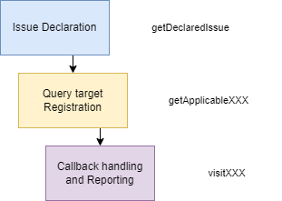
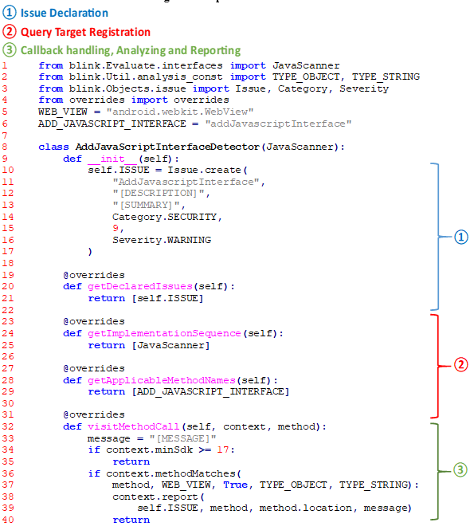

# Detector Implementation

To implement a custom Detector that operates on BLINK, there envolves three steps as follow:

BLINK boost straightforward detecting rule conversion from [Android Lint](https://developer.android.com/studio/write/lint). We can get access to Android Lint's Detector Implementation via [ASOP](https://android.googlesource.com/platform/tools/base/+/refs/heads/mirror-goog-studio-main/lint/libs/lint-checks/src/main/java/com/android/tools/lint/checks/). Most of the checks used to be written in Java and converted to Kotlin gradually. However, regardless of the programing language they are in, they share the same disign logic and process. 

Let's take a look at one of rule of Android Lint and mark its critical sections:

And here is how a converted Detector rule would be like in BLINK:

