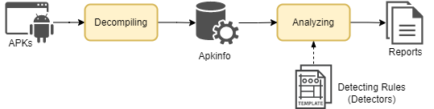

# Welcome to BLINK's documentation

BLINK (Binary LINt Kit) is an Android quality/vunlnerability assessment framework.  
It supports various Android application analyzing workflows without the need for application's source code - that is, BLINK directly takes APKs as input.  
To ensure a stable source of detecting rules and examples, BLINK also boosts similar rule definition style of that from [Android Lint](https://developer.android.com/studio/write/lint), an official Android source code linter.  

You can kown more about BLINK with how to [install](installation.md) and [manipulate](usage.md).

### BLINK workflow
BLINK consists of two major processing modules, a metaobject(Apkinfo), and numerous customizable detecting rules(Detectors).

#### Decompiling module
Leveraging slightly modified [Androgurad](https://github.com/androguard/androguard) core, BLINK decompiles and extracts every interesting resources within an APK and maps each resource into individual python objects.  
BLINK also further analyze and maintain every caller-callee, field read-field write relationships with cross reference entries, which is crucial for later needs of dataflow analysis.  

#### Analyzing module
A RuleManager is responsible for govening the availability of the Detectors as well as loading them in order into analyzing module.  
Detectors access resource or information in target APK via implementing corresponding ScannerInterfaces.  
By following Request, Callback, Report design patterns, BLINK can accommodate various workflow without any risk of confliction.

